# 训练 / 推理数据流流程图

下面的 Mermaid 流程图展示了本工程从**数据准备**到**结果导出**的完整数据流，  
每个节点均与仓库脚本及文件名保持一致。

```mermaid
flowchart TD
    A["📥 数据准备\n下载 ASVspoof2019 LA\nwget LA.zip → unzip"] --> B

    B["📋 读取协议 CSV\nprotocol/train_protocol.csv\nprotocol/dev_protocol.csv\nprotocol/eval_protocol.csv"] --> C

    C{"__cache__ 中\n存在 .npz？"}
    C -- 是 --> D["⚡ 加载缓存特征\nfeature.load_feature()\n__cache__/*.npz"]
    C -- 否 --> E

    E["🎵 特征提取\nfeature.py\ncalc_stft() / calc_cqt()\nSTFT: (freq, 200, 1)\nCQT: (100, 280, 1)"] --> F

    F{"--savedata 1？"}
    F -- 是 --> G["💾 保存特征缓存\nfeature.save_feature()\n__cache__/*.npz"]
    F -- 否 --> H
    G --> H

    D --> H

    H{"--augment 1？"}
    H -- 是 --> I["📂 增强数据集\nprotocol/aug_protocol.csv\nASVspoof2019_LA_aug/flac/\ncalc_stft() / calc_cqt()"]
    H -- 否 --> K
    I --> J["🔗 拼接增强特征\nnp.concatenate(x_train, x_aug)\nnp.concatenate(y_train, y_aug)"]
    J --> K

    K["🔀 Shuffle & 截断\nnp.random.shuffle()\n--datasize 限制样本数（可选）"] --> L

    L{"--model 选择"}
    L -- lcnn --> M["🏗️ 构建 LCNN\nmodel/lcnn.py\nbuild_lcnn(shape, n_label=2)"]
    L -- lcnn-lstm --> N["🏗️ 构建 LCNN-LSTM\nmodel/lcnn_lstm.py\nbuild_lcnn_lstm(shape, n_label=2)"]

    M --> O
    N --> O

    O["⚙️ 编译模型\nAdam(lr)\nsparse_categorical_crossentropy\nmetric: accuracy"] --> P

    P["🏋️ 训练\nmodel.fit(x_train, y_train,\n  validation_data=(x_dev, y_dev))\nEarlyStopping(patience=8)\nModelCheckpoint"] --> Q

    Q["💾 保存最优模型\n__log__/model-{model}-{feature}-{job_id}.keras"] --> R

    R["🔍 Eval 特征提取\neval_protocol.csv\ncalc_stft() / calc_cqt()\n（同样支持 __cache__）"] --> S

    S["🤖 推理\nmodel.predict(x_eval)\npred shape: (N, 2)"] --> T

    T["📊 计算指标\nmetrics.py\nscore = pred[:,0] - pred[:,1]\ncalculate_eer(y_eval, score)\ny_pred = argmax(pred)"] --> U

    U["📈 分类指标\nAccuracy / F1 / Precision\nRecall / ROC-AUC\nsklearn.metrics"] --> V

    V["📄 导出预测结果\n__log__/predictions-{model}-{feature}{AUG?}-{job_id}.csv\n列：True Label, Predicted Label,\nPred_Prob_0, Pred_Prob_1"]
```

## 关键输入 / 输出文件一览

| 文件 / 目录 | 说明 |
|---|---|
| `protocol/train_protocol.csv` | 训练集协议（`utt_id`, `key`） |
| `protocol/dev_protocol.csv` | 验证集协议 |
| `protocol/eval_protocol.csv` | 评估集协议 |
| `protocol/aug_protocol.csv` | 增强数据集协议（`--augment 1` 时使用） |
| `ASVspoof2019_LA_train/flac/` | 训练集音频（.flac） |
| `ASVspoof2019_LA_dev/flac/` | 验证集音频 |
| `ASVspoof2019_LA_eval/flac/` | 评估集音频 |
| `ASVspoof2019_LA_aug/flac/` | 增强音频（离线生成，可选） |
| `__cache__/*.npz` | 特征缓存（`save_feature` / `load_feature`） |
| `__log__/model-*.keras` | 训练保存的最优模型（`ModelCheckpoint`） |
| `__log__/predictions-*.csv` | 推理结果与指标（每行一个样本） |

## 主要脚本说明

| 脚本 | 职责 |
|---|---|
| `src/run.py` | 主入口：解析参数、调度特征提取、训练、评估 |
| `src/feature.py` | 特征提取：`calc_stft()` / `calc_cqt()`，及缓存读写 |
| `src/metrics.py` | 指标计算：`calculate_eer()`，Accuracy/F1/Precision/Recall/AUC |
| `src/augment.py` | 数据增强函数（离线增强后写入 `aug/flac/`） |
| `src/model/lcnn.py` | LCNN 模型定义（`build_lcnn`） |
| `src/model/lcnn_lstm.py` | LCNN+LSTM+自注意力池化模型（`build_lcnn_lstm`） |
| `src/model/layers.py` | 自定义 `Maxout` 层（MFM 实现） |
